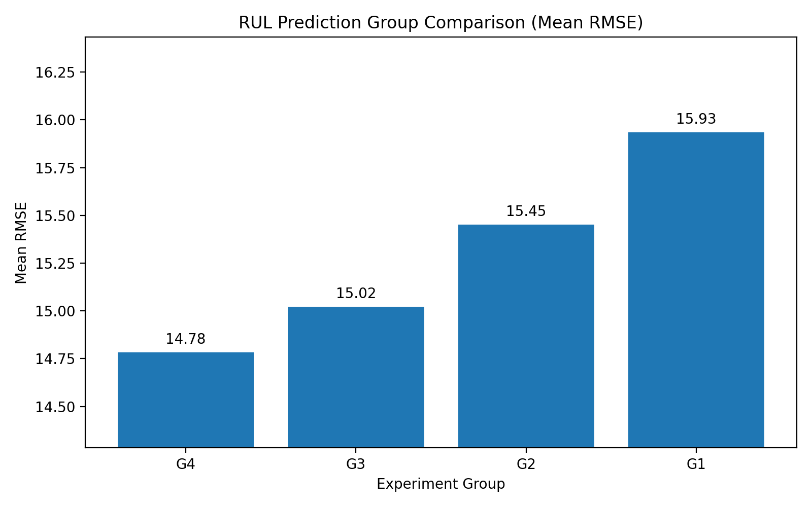

# RUL Prediction: Uncertainty-Aware Maintenance Decision Support

Employer-facing deep learning project for Remaining Useful Life (RUL) prediction on NASA C-MAPSS, focused on asymmetric loss design and predictive uncertainty for maintenance-relevant decision support.

## Project Focus

This repository is the distilled portfolio version of a larger research codebase. The active implementation lives in `src_v2/` and the checked-in public evidence lives in `public_results/` and `figures/`.

Core technical narrative:

- `G1`: CNN-BiLSTM baseline with MSE
- `G2`: baseline + Monte Carlo Dropout
- `G3`: CNN-BiLSTM + LinEx asymmetric loss
- `G4`: LinEx + Monte Carlo Dropout

## Checked-In Surfaces

- `src_v2/`: active code path for models, training, evaluation, and experiment entry scripts
- `CMAPSSData/`: NASA C-MAPSS benchmark data used by the current runners
- `public_results/`: curated result summaries for employer-facing review
- `figures/`: checked-in visual artifacts used in the root README

`outputs/` is the default generated-output directory for local experiment runs in this distilled version. It is not part of the curated checked-in surface.

## Representative Results

The tracked summary artifacts are:

- `public_results/group_comparison.csv`
- `public_results/G1_multiseed_summary.json`
- `public_results/G2_multiseed_summary.json`
- `public_results/G3_multiseed_summary.json`
- `public_results/G4_multiseed_summary.json`
- `public_results/G4_multiseed_detail.csv`

| Group | Setting | RMSE (mean +- std) | MAE (mean +- std) | NASA Score (mean) | Best RMSE |
| --- | --- | --- | --- | --- | --- |
| G1 | Baseline (MSE) | 15.93 +- 0.85 | 11.62 +- 0.64 | 509.16 | 14.86 |
| G2 | MSE + MC Dropout | 15.45 +- 0.97 | 11.21 +- 0.71 | 526.91 | 14.57 |
| G3 | LinEx | 15.02 +- 0.82 | 10.62 +- 0.75 | 518.31 | 13.75 |
| G4 | LinEx + MC Dropout | 14.78 +- 0.38 | 10.89 +- 0.28 | 376.89 | 14.17 |

G4 is the strongest overall configuration in the checked-in summaries, while G3 records the best single-run RMSE.



For the curated result bundle, see `public_results/README.md`. That surface now includes both the existing multiseed summaries and a compact single-seed local verification bundle derived from successful end-to-end runs.

## Active Entry Points

Representative experiment runners:

```bash
python src_v2/experiments_v2/G1_run.py
python src_v2/experiments_v2/G2_run.py
python src_v2/experiments_v2/G3_run.py
python src_v2/experiments_v2/G4_run.py
```

These runners use `CMAPSSData/` as the default dataset location and write generated outputs to a local `outputs/` path by default. For scratch validation, `--output-root` can redirect artifacts to a temporary directory outside the repository tree.

## Local Verification

The minimum runnable baseline path has been verified locally with `src_v2/experiments_v2/G1_run.py`. A 1-epoch smoke run completed successfully in a Conda/Mamba `base` environment with Python 3.10.16, `torch 2.10.0`, and `pandas 2.3.3`.

For local validation, outputs can be redirected with `--output-root` to a scratch directory instead of the repository tree. The recent G1 smoke run used a temporary `/tmp` output path, and no `outputs/` directory was created in this repository during that run.

This is a local execution note, not a full reproducibility claim. The repository does not currently include a pinned environment file.

## Technical Highlights

- CNN-BiLSTM sequence modeling for turbofan RUL prediction
- LinEx asymmetric loss for overestimation-sensitive training
- Monte Carlo Dropout for uncertainty-aware inference
- Multi-seed result summaries curated for reproducible portfolio review
